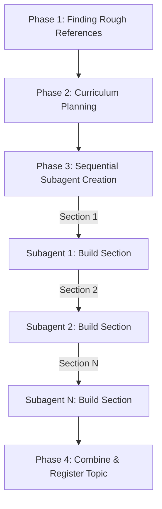

# Skill: Interactive Topic Creation (`create-topic`)

This skill guides an AI agent through creating an Open Knowledge Format (OKF) compliant knowledge bundle for the **Interactive Loom Learning OS** repository.

The topic creation pipeline strictly separates content (data in `public/okf/[topic-id]/`) from UI rendering. All topics are parsed dynamically at runtime without requiring TypeScript changes.

---

## Key Reference Documentation

Before generating content schemas or structuring sections, refer to these authoritative guides:

| Reference | Document Path | Key Contents |
|---|---|---|
| **Topic Guideline** | [`docs/creating-topics.md`](file:///Users/chanatipsaetia/Work/interactive-loom-learning-os/docs/creating-topics.md) | Bundle layout, file specs, registration requirements |
| **Section Schemas** | [`docs/sections/README.md`](file:///Users/chanatipsaetia/Work/interactive-loom-learning-os/docs/sections/README.md) | Frontmatter & YAML specs for all 15 section types |
| **Event Storming** | [`docs/event-storming-conventions.md`](file:///Users/chanatipsaetia/Work/interactive-loom-learning-os/docs/event-storming-conventions.md) | Flowchart cycles, `handledBy`, `collapsedTo`, journeys |
| **Pedagogy & Models** | [`docs/sections-reference.md`](file:///Users/chanatipsaetia/Work/interactive-loom-learning-os/docs/sections-reference.md) | Curriculum ordering, cognitive mental models |

---

## Topic Bundle Directory Structure

```
public/okf/[topic-id]/
├── index.md                        # OKF directory listing (markdown links to section manifests)
├── index.yaml                      # App metadata (category, tags, list of ALL related YAML files)
└── sections/
    ├── intro/
    │   ├── section.md              # Frontmatter: type, title, resource
    │   └── content.md              # Markdown text data
    ├── flowchart/
    │   ├── section.md              # resource: "."
    │   ├── actors.yaml
    │   ├── systems.yaml
    │   ├── steps.yaml
    │   └── journeys.yaml
    ├── tradeoffs/
    │   ├── section.md              # resource: "."
    │   └── scenario-1.yaml
    └── [other-sections]/
```

---

## Multi-Agent Creation Workflow

Execute topic creation in **4 sequential phases**:



---

### Phase 1: Finding Rough References

1. **Goal**: Establish topic boundaries, gather reference materials, and confirm the starting domain scope before delegating section generation.
2. **Actions**:
   - Search web, project files, or provided inputs for authoritative sources, specs, architectural diagrams, or technical documentation related to the target topic.
   - Extract core entities, workflows, key trade-offs, taxonomies, and formulas.
   - Consolidate reference findings into a structured summary that will be passed to subagents in Phase 3.

---

### Phase 2: Curriculum Planning

1. **Goal**: Design a pedagogically sound section sequence and map retrieved references to specific section types.
2. **Actions**:
   - Determine target topic ID (kebab-case, e.g., `agent-orchestration` or `cache-invalidation`).
   - Define section progression following progressive disclosure:
     - **Foundations**: `text`, `bullets`, `flashcards`
     - **Core Concepts**: `concept-map`, `taxonomy-browser`
     - **Architecture & Flow**: `flowchart` (Event Storming)
     - **Interactive Sandbox / Application**: `tradeoff-sandbox`, `scenario`, `decision-tree`, `formula-sandbox`
     - **Reflection & Assessment**: `reflection-sequence`, `reflection-template`, `quiz`
   - For each planned section, define:
     - Directory path (`sections/[section-name]/`)
     - Section type (`type`)
     - Display title and optional heading
     - Educational purpose & mental model target (refer to [`docs/sections-reference.md`](file:///Users/chanatipsaetia/Work/interactive-loom-learning-os/docs/sections-reference.md))
     - Reference excerpt & target data scope assigned to this section

---

### Phase 3: Sequential Section Generation via Subagents

1. **Goal**: Build each section one by one using dedicated subagent executions to maintain high schema accuracy and context isolation.
2. **Actions**:
   - Create the target directory: `mkdir -p public/okf/[topic-id]/sections/`.
   - **For each section in the curriculum sequentially**:
     - Spawn a subagent (or execute task) dedicated solely to authoring that section.
     - **Input prompt to subagent must include**:
       1. Topic ID & target directory (`public/okf/[topic-id]/sections/[section-name]/`).
       2. Section `type`, `title`, and `heading`.
       3. Educational purpose and mental model.
       4. Relevant reference excerpts from Phase 1.
       5. Direct instructions referencing [`docs/sections/README.md`](file:///Users/chanatipsaetia/Work/interactive-loom-learning-os/docs/sections/README.md) for frontmatter and schema requirements.
       6. Special constraints:
          - If `flowchart`: Must conform to [`docs/event-storming-conventions.md`](file:///Users/chanatipsaetia/Work/interactive-loom-learning-os/docs/event-storming-conventions.md). Complete cycle `EVENT → POLICY → COMMAND → AGGREGATE/EXTERNAL → EVENT`. HandledBy points to duplicate node; duplicate node maps via `collapsedTo`.
          - If `taxonomy-browser`: Icons must be valid [Lucide icons](https://lucide.dev/icons/); colors must be Catppuccin palette (`mauve`, `rose`, `sky`, `green`, `peach`, `red`, `yellow`, `teal`).
     - **Wait for the subagent to complete** `section.md` and all related `.yaml`/`.md` files.
     - Validate file existence and basic schema format before proceeding to the next section.

---

### Phase 4: Combine & Register Topic

1. **Goal**: Connect all created sections into a unified OKF knowledge bundle and register it in the application.
2. **Actions**:
   - **Create `public/okf/[topic-id]/index.md`**:
     - Main heading `# [Topic Display Title]` and description.
     - Group section links under category headings (e.g. `## Foundations`, `## Architecture`, `## Interactive`):
       ```markdown
       # Topic Display Title

       Description of the topic...

       ## Foundations
       * [Introduction](sections/intro/section.md) — Overview of topic
       * [Vocabulary](sections/flashcards/section.md) — Essential terms

       ## Architecture
       * [System Architecture](sections/flowchart/section.md) — Event Storming process
       ```
   - **Create `public/okf/[topic-id]/index.yaml`**:
     - Declare `category` and `tags`.
     - Collect **ALL** `.yaml` data files from every section into the `related` list:
       ```yaml
       category: Architecture
       tags:
         - tag1
         - tag2
       related:
         - sections/flashcards/glossary.yaml
         - sections/flowchart/actors.yaml
         - sections/flowchart/systems.yaml
         - sections/flowchart/steps.yaml
         - sections/flowchart/journeys.yaml
         - sections/tradeoffs/scenario-1.yaml
         - sections/quiz/questions.yaml
       ```
   - **Register Topic in `public/okf/index.md`**:
     - Add topic link under appropriate category in root index:
       ```markdown
       ## Architecture
       * [My Topic Title](my-topic/index.md) — A brief description of what this topic covers
       ```
   - **Update Fallback Manifest**:
     - Run `node scripts/update-okf-manifest.js` to update `public/index.yaml`.
   - **Verify Build**:
     - Run `npm run typecheck` and `npm run test`.
